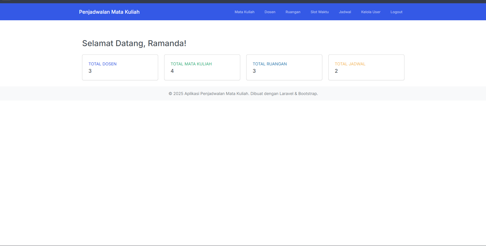

# 📚 JadwalMatakuliah

Aplikasi web berbasis **Laravel** untuk mengelola dan menampilkan **jadwal mata kuliah**.  
Didesain agar dosen dan mahasiswa dapat melihat serta mengatur jadwal per semester dengan mudah.  
Project ini dijalankan menggunakan **Laragon** sebagai local development environment.

---

## 🧰 Teknologi yang Digunakan

- **PHP 8+**  
- **Laravel Framework**  
- **MySQL** (via Laragon)  
- **Bootstrap 5** untuk tampilan antarmuka  
- **Vite** untuk manajemen asset (CSS & JS)

---

## ✨ Fitur Utama

- CRUD (Create, Read, Update, Delete) jadwal mata kuliah  
- Penjadwalan berdasarkan dosen, ruang, dan semester  
- Tampilan antarmuka yang responsif dan ringan  
- Routing terstruktur melalui file `web.php`  
- Integrasi database MySQL lokal via Laragon  
- Validasi input dan pengelolaan data dinamis  

---

## ⚙️ Cara Instalasi & Menjalankan (Menggunakan Laragon)

1. **Clone repository ini**
   ```bash
   git clone https://github.com/Ramandanizarf/JadwalMatakuliah.git
   ```

2. **Pindahkan folder project ke direktori Laragon**
   ```
   C:\laragon\www\
   ```

3. **Buka Laragon**, lalu pastikan **Apache** dan **MySQL** sedang berjalan.

4. **Masuk ke folder project melalui terminal (Laragon Terminal / CMD)**
   ```bash
   cd C:\laragon\www\JadwalMatakuliah
   ```

5. **Install dependency Laravel**
   ```bash
   composer install
   ```

6. **Install dependency frontend**
   ```bash
   npm install
   ```

7. **Konfigurasi file `.env`**
   (Salin dari `.env.example` jika belum ada)
   ```bash
   cp .env.example .env
   ```

   Lalu sesuaikan pengaturan database (default Laragon):
   ```env
   DB_CONNECTION=mysql
   DB_HOST=127.0.0.1
   DB_PORT=3306
   DB_DATABASE=penjadwalan
   DB_USERNAME=root
   DB_PASSWORD=
   ```

8. **Generate key aplikasi**
   ```bash
   php artisan key:generate
   ```

9. **Migrasi database**
   ```bash
   php artisan migrate
   ```

10. **(Opsional)** Isi data awal jika sudah ada seeder
    ```bash
    php artisan db:seed
    ```

11. **Jalankan server Laravel**
    ```bash
    php artisan serve
    ```

12. **Jalankan build asset frontend**
    ```bash
    npm run dev
    ```

13. **Akses aplikasi melalui browser**
    ```
    http://localhost:8000
    ```

---

## 🖼️ Tampilan Aplikasi (Screenshots)

Berikut beberapa area yang bisa kamu tambahkan screenshot-nya nanti 👇  
> Simpan semua gambar di folder `docs/screenshots/` agar struktur tetap rapi.

| Halaman | Screenshot |
|----------|-------------|
| **Dashboard Utama** |  |
| **Daftar Jadwal Mata Kuliah** |  |
| **Form Tambah / Edit Jadwal** |  |
| **Detail Mata Kuliah** |  |

---

## 👨‍💻 Kontributor

| Nama | Peran |
|------|--------|
| Ramanda Nizar | Pengembang Utama |

---

## 📄 Lisensi

Project ini dilisensikan di bawah **MIT License** — silakan lihat file `LICENSE` untuk detailnya.

---

## 🧭 Rencana Pengembangan

- 🔐 Fitur login & manajemen user (dosen / mahasiswa)  
- 📅 Export jadwal ke PDF / iCal  
- 📱 Optimalisasi tampilan untuk perangkat mobile  
- 🧩 Sistem deteksi konflik jadwal otomatis  

---
