# 📚 JadwalMatakuliah

Aplikasi web berbasis **Laravel** untuk mengelola dan menampilkan **jadwal mata kuliah**.  
Didesain agar **dosen dan mahasiswa** dapat melihat serta mengatur jadwal per semester dengan mudah.  
Dikembangkan menggunakan **Laragon** sebagai *local development environment*.

---

## 🧰 Teknologi yang Digunakan

- **PHP 8+**
- **Laravel 10+**
- **MySQL** (via Laragon)
- **Bootstrap 5**
- **Vite** (untuk pengelolaan asset CSS & JS)
- **Node.js + NPM**

---

## ⚙️ Langkah-Langkah Instalasi (Menggunakan Laragon)

### 1️⃣ Clone Repository
```bash
git clone https://github.com/Ramandanizarf/JadwalMatakuliah.git
```

### 2️⃣ Pindahkan ke Folder Laragon
Letakkan folder hasil clone di:
```
C:\laragon\www\
```

### 3️⃣ Jalankan Apache & MySQL
Buka **Laragon**, lalu tekan tombol **Start All**.

### 4️⃣ Buka Terminal (CMD / Git Bash / Laragon Terminal)
Masuk ke folder project:
```bash
cd C:\laragon\www\JadwalMatakuliah
```

### 5️⃣ Install Dependency Laravel
```bash
composer install
```

### 6️⃣ Install Dependency Frontend
```bash
npm install
```

### 7️⃣ Buat File `.env`
Salin dari contoh:
```bash
cp .env.example .env
```

Lalu ubah pengaturan database:
```env
DB_CONNECTION=mysql
DB_HOST=127.0.0.1
DB_PORT=3306
DB_DATABASE=penjadwalan
DB_USERNAME=root
DB_PASSWORD=
```

### 8️⃣ Generate Application Key
```bash
php artisan key:generate
```

### 9️⃣ Migrasi Database
```bash
php artisan migrate
```

### 🔟 (Opsional) Isi Data Awal
Jika tersedia seeder:
```bash
php artisan db:seed
```

### 1️⃣1️⃣ Jalankan Server Laravel
```bash
php artisan serve
```

Akses aplikasi di:
```
http://localhost:8000
```

### 1️⃣2️⃣ Jalankan Vite Dev Server
Buka terminal baru:
```bash
npm run dev
```

---

## 🧩 Struktur Proyek

```
JadwalMatakuliah/
├── app/
│   ├── Http/
│   │   ├── Controllers/
│   │   │   ├── CourseController.php
│   │   │   ├── LecturerController.php
│   │   │   ├── RoomController.php
│   │   │   ├── ScheduleController.php
│   │   │   ├── TimeslotController.php
│   │   │   ├── UserController.php
│   │   │   └── LoginController.php
│   │   └── Middleware/CheckRole.php
│   └── Models/
│       ├── Course.php
│       ├── Lecturer.php
│       ├── Program.php
│       ├── Role.php
│       ├── Room.php
│       ├── Schedule.php
│       ├── Timeslot.php
│       └── User.php
│
├── database/
│   ├── migrations/
│   ├── seeders/
│   └── database.sqlite
│
├── public/
│   ├── favicon.ico
│   ├── index.php
│   └── robots.txt
│
├── resources/
│   ├── css/
│   ├── js/
│   └── views/
│       ├── auth/
│       ├── courses/
│       ├── lecturers/
│       ├── rooms/
│       ├── schedules/
│       ├── timeslots/
│       └── users/
│
├── routes/
│   └── web.php
│
└── composer.json
```

---

## ✨ Fitur Utama

| Fitur | Deskripsi |
|-------|------------|
| 👩‍🏫 **Manajemen Dosen & Mata Kuliah** | CRUD untuk dosen dan mata kuliah |
| 🕒 **Penjadwalan Otomatis & Manual** | Input jadwal berdasarkan dosen, ruang, dan waktu |
| 🧩 **Manajemen Ruangan & Timeslot** | Tambah/edit ruangan dan slot waktu |
| 🔐 **Autentikasi & Role User** | Login, registrasi, dan pembagian hak akses |
| 🎨 **UI Responsif** | Menggunakan Bootstrap 5 |
| ⚙️ **Validasi & Proteksi Data** | Validasi form dan relasi antar tabel |

---

## 📸 Tampilan Aplikasi

<details>
<summary>🪪 Halaman Login</summary>

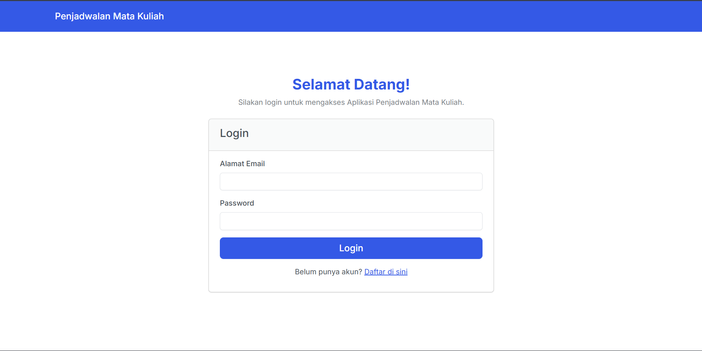
</details>

<details>
<summary>🧍‍♂️ Halaman Registrasi</summary>

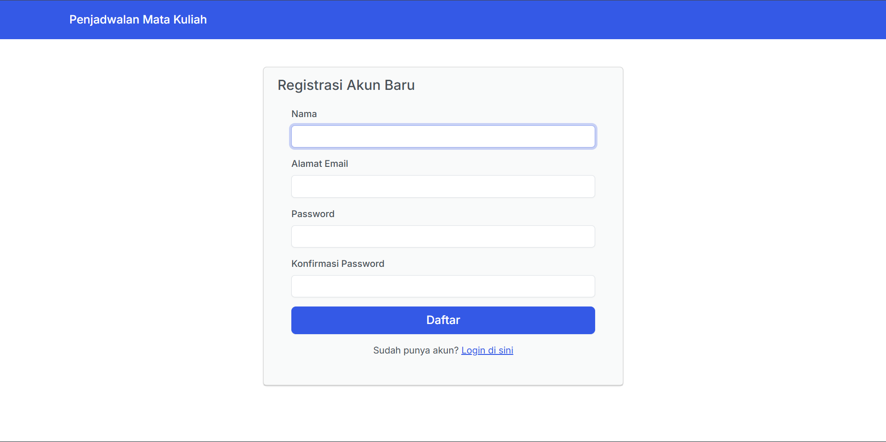
</details>

<details>
<summary>📘 Halaman Mata Kuliah</summary>

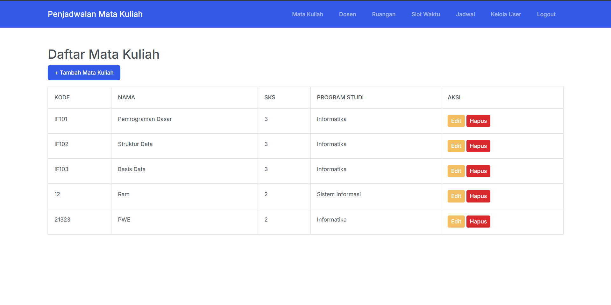
</details>

<details>
<summary>➕ Tambah Mata Kuliah</summary>

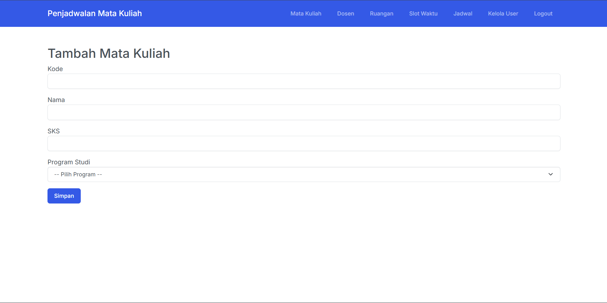
</details>

<details>
<summary>✏️ Edit Mata Kuliah</summary>

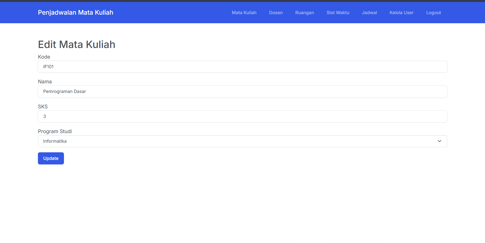
</details>

<details>
<summary>👨‍🏫 Daftar Dosen</summary>

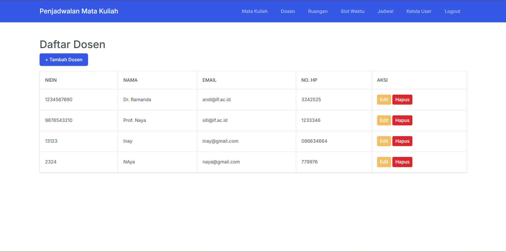
</details>

<details>
<summary>👨‍🏫 Tambah Dosen Baru</summary>


</details>

<details>
<summary>👨‍🏫 Edit Data Dosen</summary>

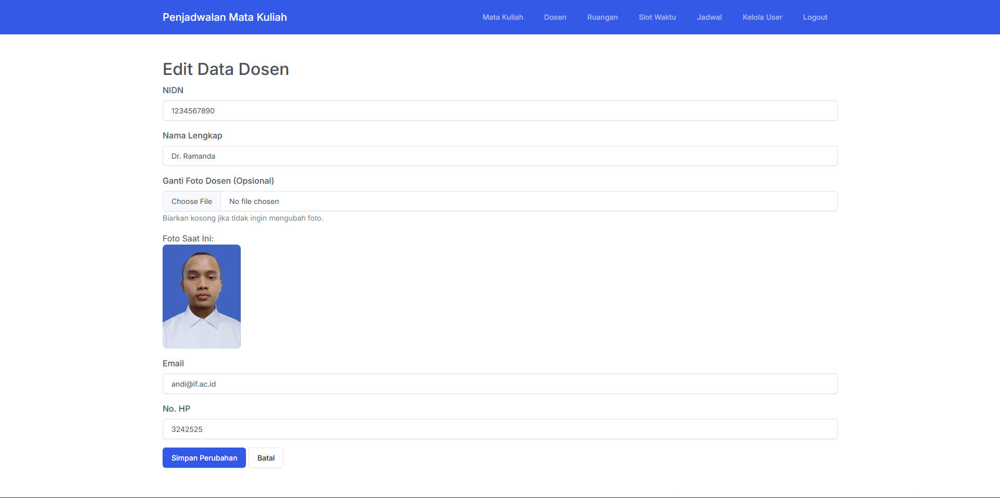
</details>

<details>
<summary>👨‍🏫 Daftar Ruangan</summary>

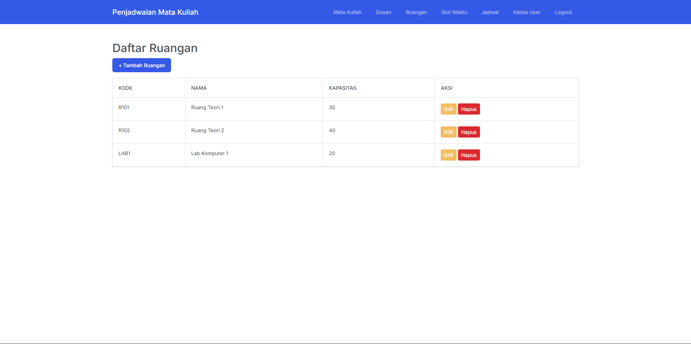
</details>

<details>
<summary>👨‍🏫 Tamabah Ruangan</summary>

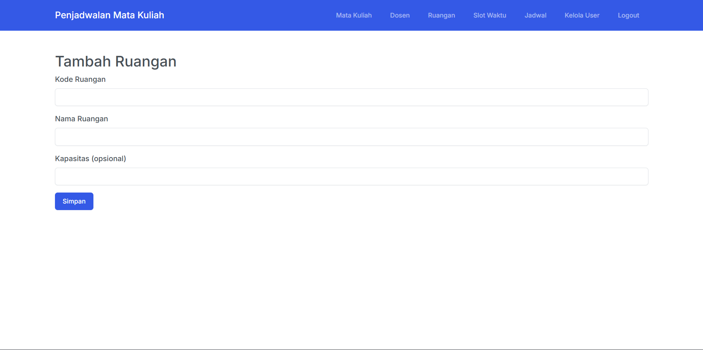
</details>

<details>
<summary>👨‍🏫 Edit Ruangan</summary>

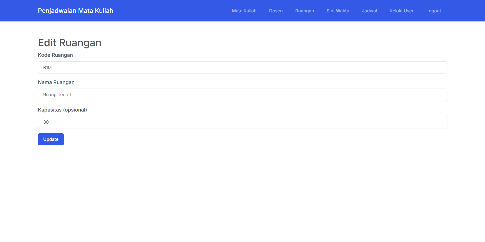
</details>

<details>
<summary>👨‍🏫 Daftar Slotwaktu</summary>

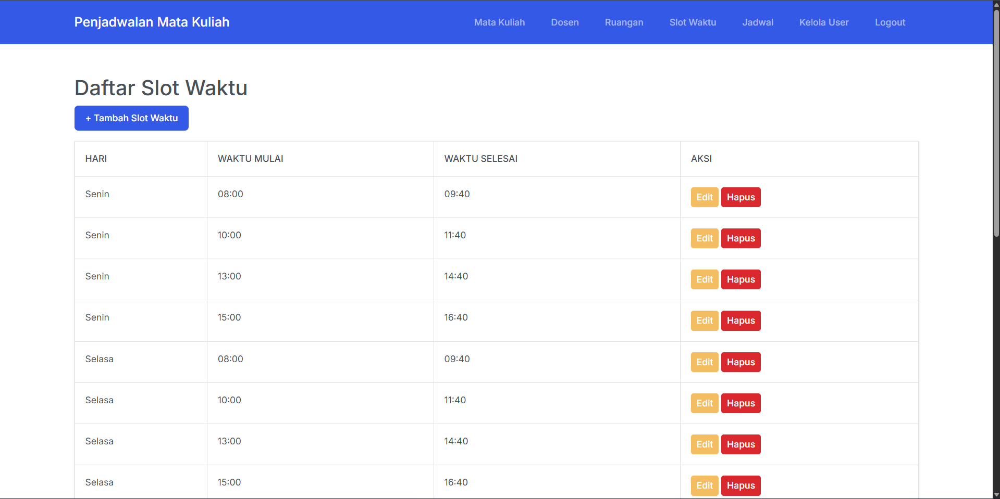
</details>

<details>
<summary>👨‍🏫 Tambah Slotwaktu</summary>

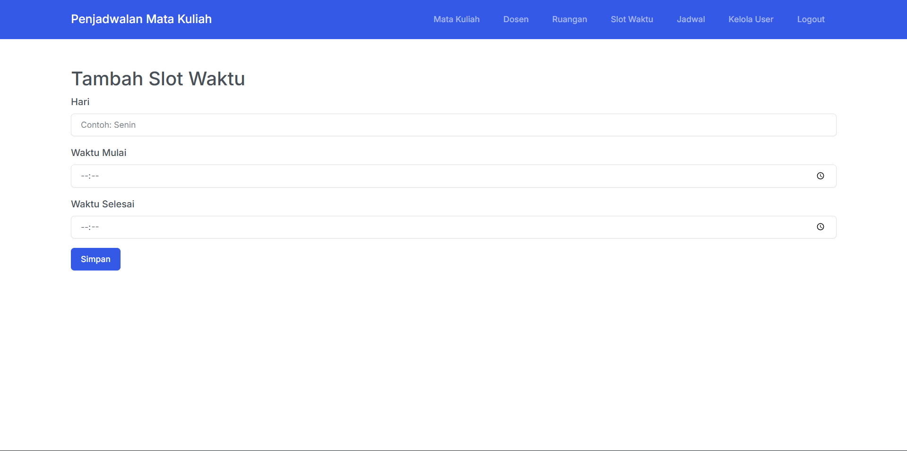
</details>

<details>
<summary>👨‍🏫 Edit Slotwaktu</summary>

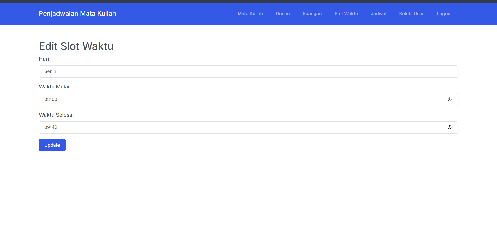
</details>

<details>
<summary>👨‍🏫 Daftar Jadwal</summary>

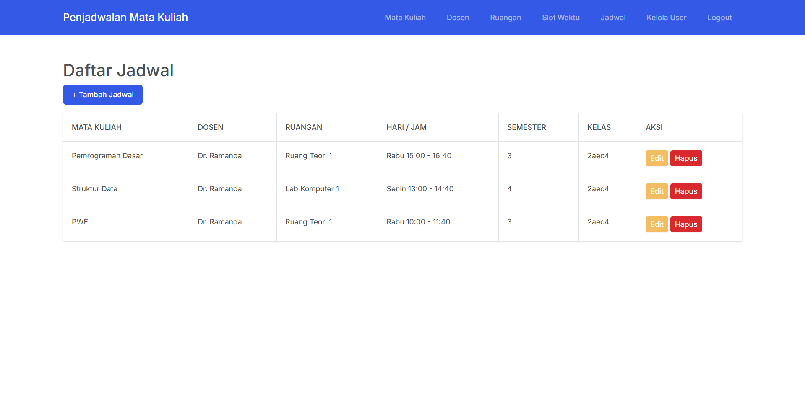
</details>

<details>
<summary>👨‍🏫 Tambah Jadwal</summary>

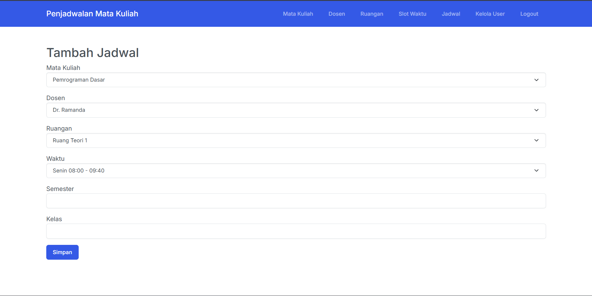
</details>

<details>
<summary>👨‍🏫 Edit Jadwal</summary>

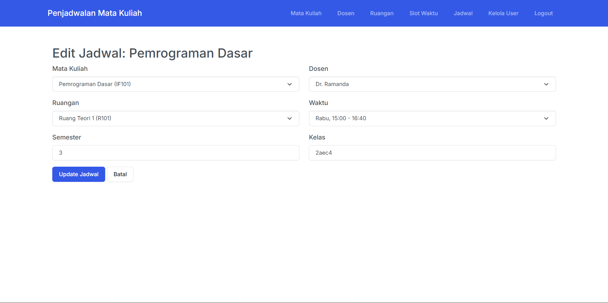
</details>

<details>
<summary>👨‍🏫 Kelola User</summary>

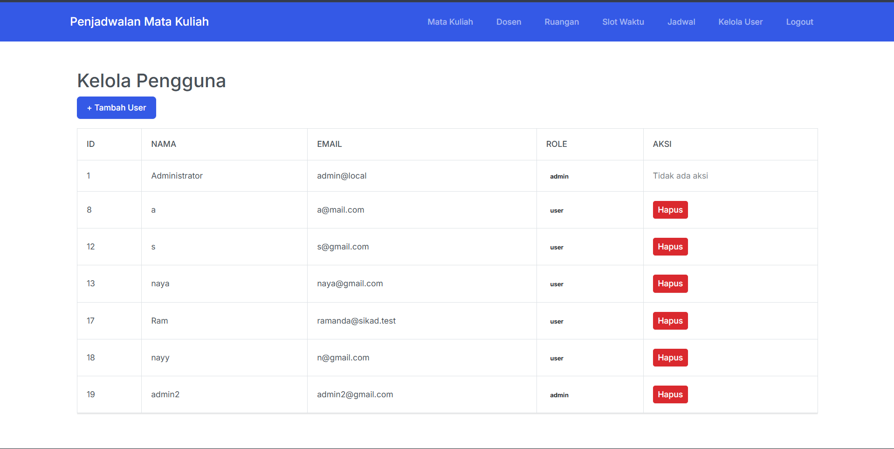
</details>

<details>
<summary>👨‍🏫 Tambah User</summary>

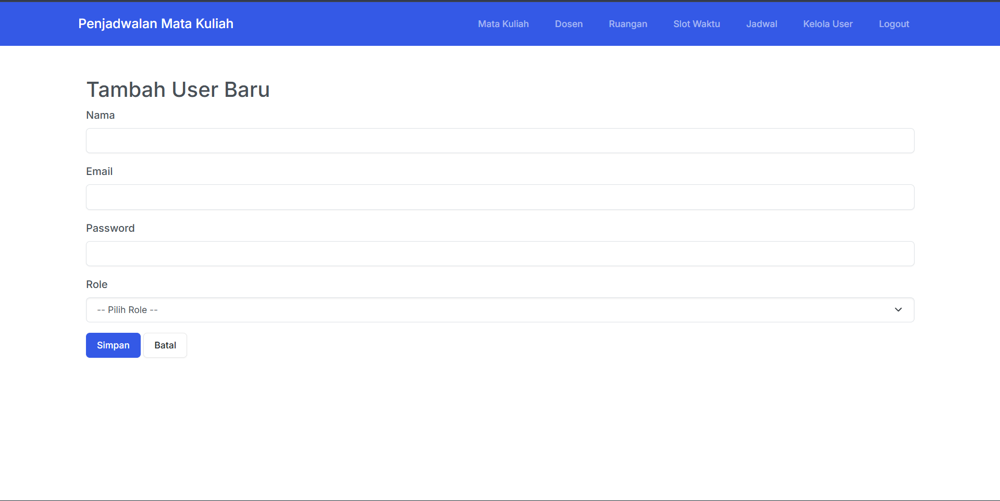
</details>

<details>
<summary>👨‍🏫 Tampilan User</summary>

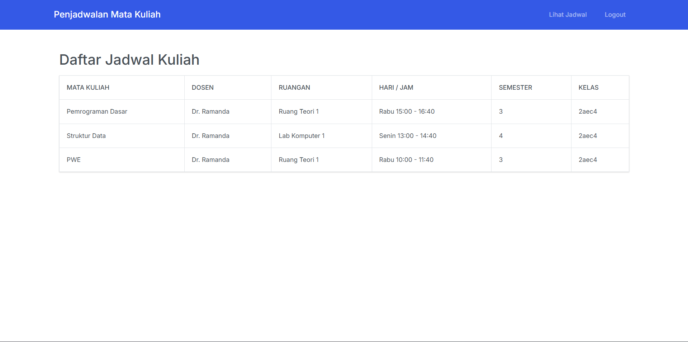
</details>

---

## 👨‍💻 Kontributor

| Nama | Peran |
|------|--------|
| **Ramanda** | Pengembang Utama |

---

## 💬 Dukungan

Jika menemukan bug atau punya saran fitur baru, silakan buka *issue* di:  
👉 [GitHub Issues](https://github.com/Ramandanizarf/JadwalMatakuliah/issues)
